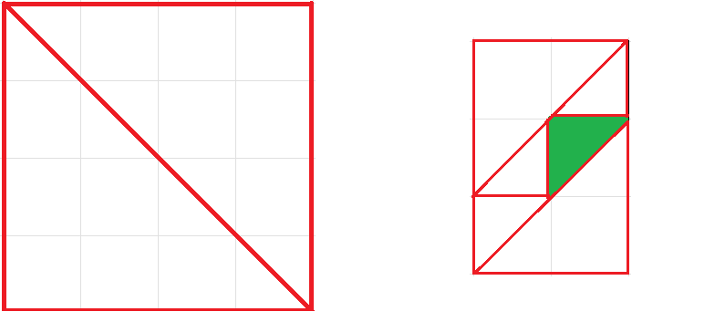

# Тренировки по алгоритмам 4.0 от Яндекса — Забег
## A. Объединение последовательностей

| <!-- -->            | <!-- -->                         |
|:-------------------:|:--------------------------------:|
| Ограничение времени |	3 секунды                        |
| Ограничение памяти  |	512Mb                            |
| Ввод                |	стандартный ввод или input.txt   |
| Вывод               |	стандартный вывод или output.txt |

Даны две бесконечных возрастающих последовательности чисел A и B. i-ый член последовательности A равен $i^2$. i-ый член последовательности B равен $i^3$.  
Требуется найти $C_x$, где C – возрастающая последовательность, полученная при объединении последовательностей A и B. Если существует некоторое число, которое встречается и в последовательности A и в последовательности B, то в последовательность C это число попадает в единственном экземпляре.

### Формат ввода
В единственной строке входного файла дано натуральное число $x$ $(1 ≤ x ≤ 10^7)$.

### Формат вывода
В выходной файл выведите $C_x$.

#### Пример 1
**Ввод**
```
1
```
**Вывод**
```
1
```

#### Пример 2
**Ввод**
```
2
```
**Вывод**
```
4
```

#### Пример 3
**Ввод**
```
4
```
**Вывод**
```
9
```

## B. Зеркальная z-функция

| <!-- -->            | <!-- -->                         |
|:-------------------:|:--------------------------------:|
| Ограничение времени |	2 секунды                        |
| Ограничение памяти  |	512Mb                            |
| Ввод                |	стандартный ввод или input.txt   |
| Вывод               |	стандартный вывод или output.txt |

Строка S состоит из N букв. Зеркальная z-функция определяется для индекса i как максимально возможное k, такое что:  
$S[1] + S[2] + S[3] + … + S[k] = S[i] + S[i–1] + S[i–2] + ... + S[i–k+1]$

Определите значение зеркальной z-функции для всех i от 1 до N.

### Формат ввода
В первой строке записано одно число N (1 ≤ N ≤ 200000). Во второй строке записана строка длиной N символов, состоящая только из заглавных и строчных латинских букв.

### Формат вывода
Выведите N чисел — значения функции для i от 1 до N.

#### Пример 1

**Ввод**
```
5
BBABB
```
**Вывод**
```
1 2 0 1 5
```

#### Пример 2

**Ввод**
```
49
burannarubabyrrybaglipspiritmatankollokvzumbboyus
```
**Вывод**
```
1 0 0 0 0 0 0 0 0 10 0 1 0 0 0 0 1 0 0 0 0 0 0 0 0 0 0 0 0 0 0 0 0 0 0 0 0 0 0 0 0 0 0 1 1 0 0 0 0
```

## C. Переезд

| <!-- -->            | <!-- -->                         |
|:-------------------:|:--------------------------------:|
| Ограничение времени | 2 секунды                        |
| Ограничение памяти  |	512Mb                            |
| Ввод                |	стандартный ввод или input.txt   |
| Вывод               |	стандартный вывод или output.txt |

Васина семья переезжает в новую квартиру, а переезд — это всегда хлопоты. Например, Васе совершенно не хочется расставаться со своей коллекцией кружек, которую он собрал, посещая олимпиады. Все-таки, его коллекция самая большая в мире и насчитывает $10^7$ экземпляров! Поскольку каждая кружка весит 100 грамм, для ее перевозки Вася хочет нанять грузовик. Однако, на всех дорогах висят знаки, ограничивающие вес транспорта. Кроме того, ровно через 24 часа выходит новый эпизод любимого Васиного сериала, пропускать который он отказывается наотрез! От всей этой неразберихи у Васи голова идет кругом, и он обращается к вам за помощью.  
Вася хочет перевезти как можно больше кружек за первый же рейс, но если фуру, которая и так весит 3 тонны, полностью нагрузить кружками, то, возможно, придется ехать в объезд. Так сколько же кружек можно довезти до новой квартиры, не нарушая правил дорожного движения и не пропустив начало передачи?

### Формат ввода
В первой строке входного файла указаны два числа $N$ и $M$ — число перекрестков на схеме города и число дорог соответственно $(1 ≤ N ≤ 500)$. В следующих M строках идет описание дорог. Каждая дорога описывается четырьмя числами: $a_i$, $b_i$, $t_i$ и $w_i$.  
$a_i$ и $b_i$ — это номера перекрестков, которые соединяет дорога, $a_i ≠ b_i$, $1 ≤ a_i$, $b_i ≤ N$. Вася знает, что если есть дорога, соединяющая напрямую два перекрестка, то она ровно одна.  
  
$t_i$ — это время в минутах, которое тратится на проезд по этой дороге, $0 ≤ t_i ≤ 1440$.
  
$w_i$ — это максимальная масса в граммах, которую можно провозить по этой дороге, $0 ≤ w_i ≤ 10^9$.
  
Старая квартира Васи находится на этой схеме на перекрестке с номером $1$, а новая — на перекрестке с номером $N$.

### Формат вывода
Выведите ровно одно число — наибольшее количество кружек, которое Вася может увезти за один рейс, не нарушая правил дорожного движения и не опоздав к началу сериала.

#### Пример 
**Ввод**
```
3 3
2 3 40 3000299
1 3 4 3000056
1 2 10 3000201
```
**Вывод**
```
2
```
### Примечание
Перекрестки могут соединять любое количество дорог, по перекрестку можно проехать в любом направлении (то есть с любой дороги на любую другую), все дороги допускают движение в обе стороны.

## D. Кирпичи

| <!-- -->            | <!-- -->                         |
|:-------------------:|:--------------------------------:|
| Ограничение времени |	3 секунды                        |
| Ограничение памяти  |	512Mb                            |
| Ввод                |	стандартный ввод или input.txt   |
| Вывод               |	стандартный вывод или output.txt |

Вася решил выложить бордюр из кипричей для дорожки на своем участке. Расположенный по соседству кирпичный завод выпускает кирпичи длиной $A_1, A_2, …, A_m$. Промоутеры завода раздают потенциальным клиентам по 2 кирпича бесплатно. Вася взял по 2 кирпича каждого типа и теперь хочет узнать, может ли он выложить из них бордюр длиной N и толщиной в один кирпич.

### Формат ввода
Сначала вводится число N $(1 ≤ N ≤ 10^9)$, затем — число M $(1 ≤ M ≤ 15)$ и далее M различных чисел $A_1, A_2, …, A_M$ $(1 ≤ A_i ≤ 10^9)$.

### Формат вывода
Выведите сначала K — количество кипричей, которое нужно использовать для выкладывания бордюра, если можно выложить бордюр длиной ровно N. Далее выведите K чисел, задающих длины использованных кирпичей. Если решений несколько, выведите вариант, в котором Вася использует наименьшее количество кирпичей. Если таких вариантов несколько, выведите любой из них.  
Если для выкладывания бордюра придется обязательно разломить какой-то кирпич, то выведите одно число 0. Если же у Васи не хватит кипричей, чтобы выложить бордюр, выведите одно число –1 (минус один).

#### Пример 1

**Ввод**
```
5 2
1 2
```
**Вывод**
```
3
2 2 1 
```

#### Пример 2

**Ввод**
```
7 2
1 2
```
**Вывод**
```
-1
```

#### Пример 3

**Ввод**
```
5 2
3 4
```
**Вывод**
```
0
```

## E. Упаковка эчпочмаков

| <!-- -->            | <!-- -->                         |
|:-------------------:|:--------------------------------:|
| Ограничение времени |	3 cекунды                        |
| Ограничение памяти  |	512Mb                            |
| Ввод                |	стандартный ввод или input.txt   |
| Вывод               |	стандартный вывод или output.txt |

Андрей работает мыловаром и живет в общежитии со своим соседом Азатом. Бабушка прислала Азату коробку своих фирменных эчпочмаков. Эчпочмаки пахли так вкусно, что Андрей не выдержал и съел некоторые из них.  
Коробка с эчпочмаками — это прямоугольник размером N × M. Фирменные эчпочмаки бабушки Азата представляют собой непересекающиеся равнобедренные треугольники, вершины которых имеют целые координаты (начало координат в левом нижнем углу коробки). Хотя бы одна сторона каждого эчпочмака параллельна стороне коробки.  
  
Андрей решил оставить уцелевшие эчпочмаки на своих местах, а взамен съеденных приготовить новые и расположить их так, чтобы никакие два эчпочмака не пересекались и в коробке не осталось свободного места. Приготовленные Андреем эчпочмаки также должны быть равнобедренными треугольниками, их вершины должны иметь целочисленные координаты и хотя бы одна из сторон должна быть параллельна стороне коробки.  
  
Определите минимальное количество эчпочмаков, которые должен приготовить Андрей и координаты, в которых их необходимо разместить. Если правильных ответов несколько — выведите любой из них.

### Формат ввода
В первой строке вводится три целых числа $N, M$ и $K$ $(1 ≤ N, M ≤ 4, 0 ≤ K ≤ 32)$ — размеры коробки и количество уцелевших эчпочмаков бабушки Азата.  
Следующие K строк содержат по 6 координат $(x1, y1)$, $(x2, y2)$, $(x3, y3)$ $(0 ≤ x_i ≤ N, 0 ≤ y_i ≤ M)$.

### Формат вывода
Выведите число Ө — минимальное количество эчпочмаков, которые должен приготовить Андрей.  
В следующих Ө строках выведите по 6 чисел — координаты эчпочмаков в том же формате, как во входных данных.  
Если правильных ответов несколько — выведите любой из них.

#### Пример 1

**Ввод**
```
4 4 0
```
**Вывод**
```
2
0 0 0 4 4 0 
0 4 4 0 4 4 
```

#### Пример 2

**Ввод**
```
2 3 1
1 1 2 2 1 2
```
**Вывод**
```
5
0 0 2 0 2 2 
0 1 0 3 2 3 
0 1 1 1 1 2 
0 0 0 1 1 1 
1 2 2 2 2 3 
```

### Примечание

Рисунки соответствуют примерам. Эчпочмаки от бабушки покрашены в зеленый, а приготовленные Андреем имеют красный контур  

